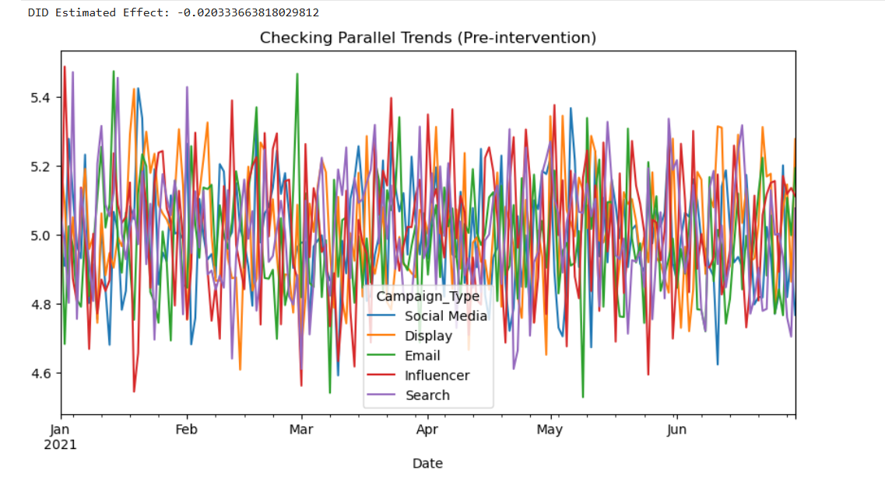
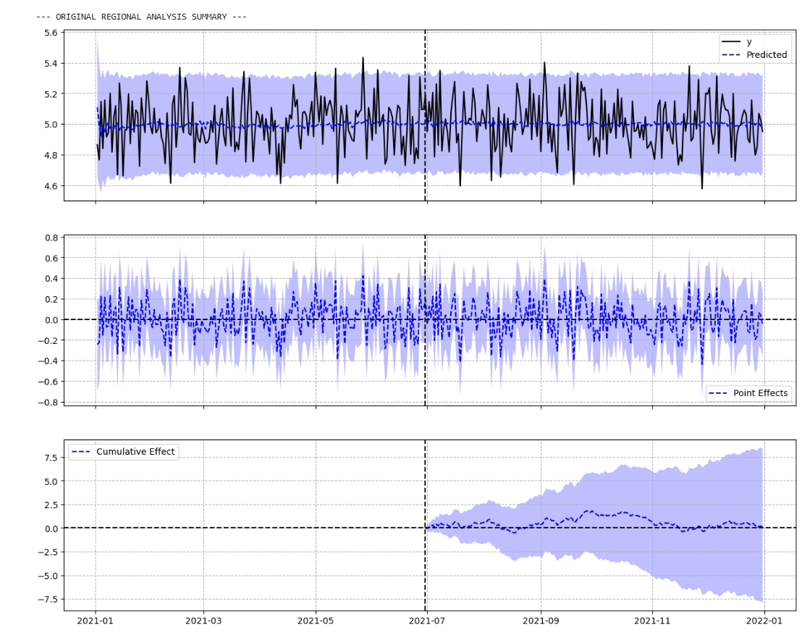
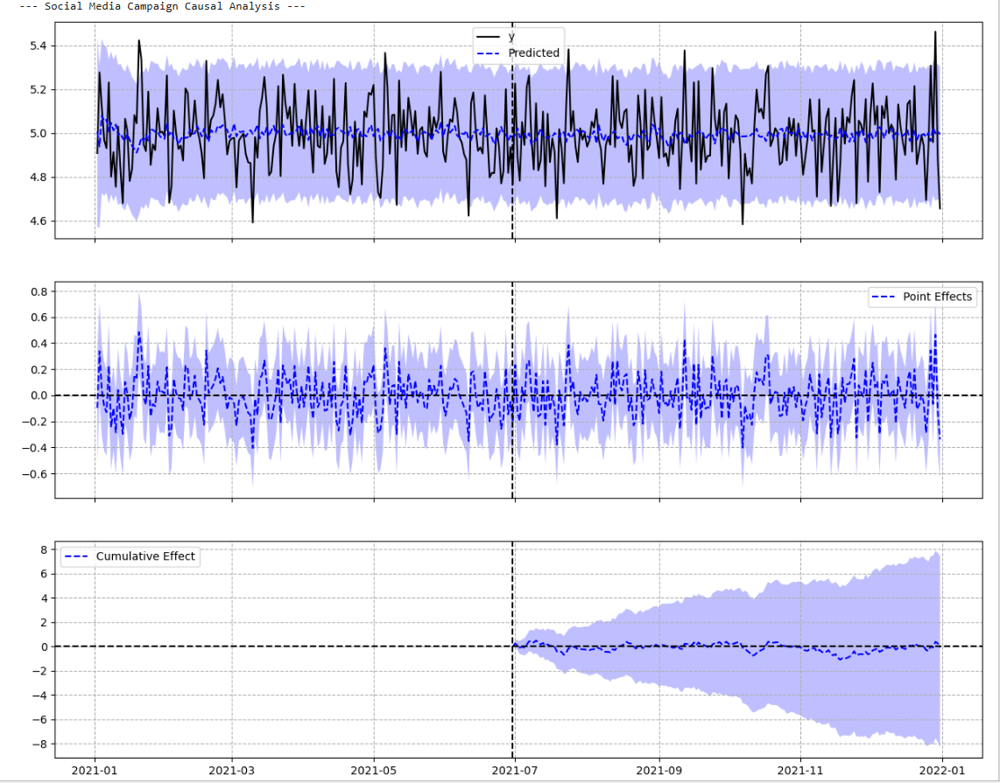
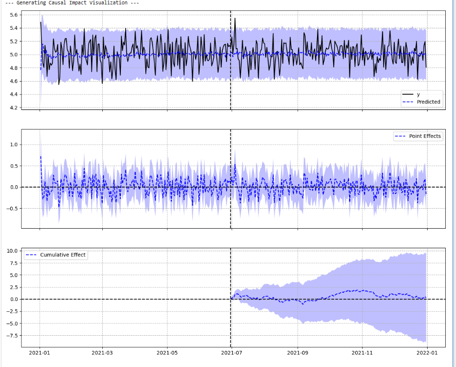
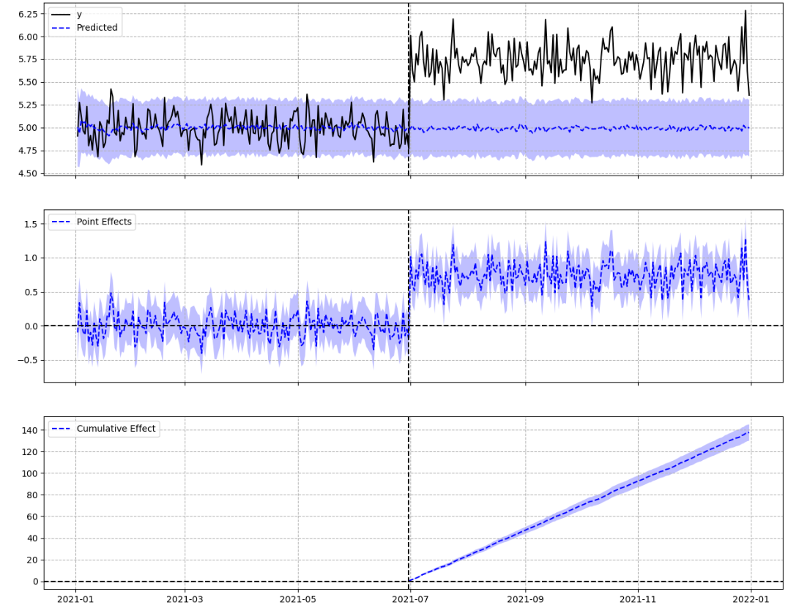
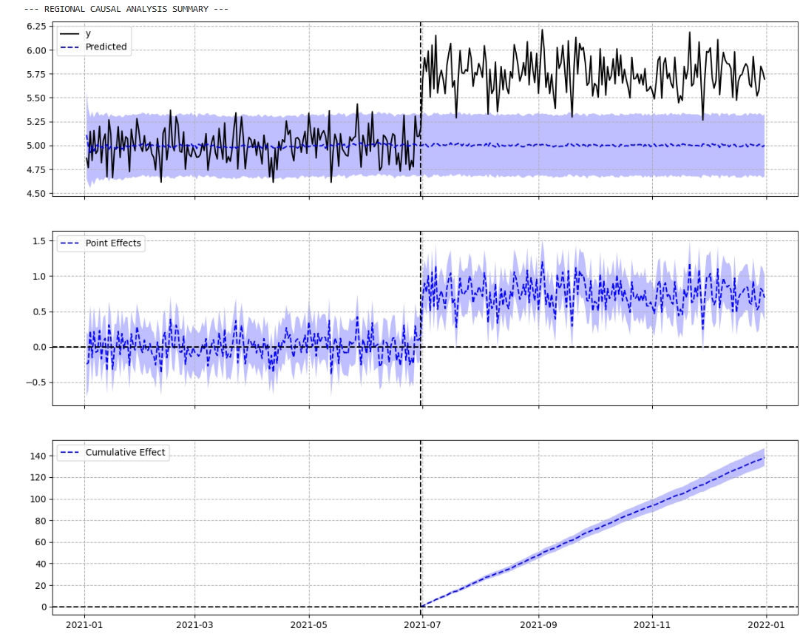

# Causal Inference: Marketinq Kampaniyasının ROI Analizi 📊

Bu layihədə müşahidə məlumatları (observational data) üzərində marketinq kampaniyalarının effektivliyini ölçmək üçün **Causal Inference** (Səbəb-Nəticə əlaqəsi) metodları tətbiq olunmuşdur. Analiz zamanı həm real vəziyyət qiymətləndirilmiş, həm də modelin həssaslığını yoxlamaq üçün simulyasiyalar aparılmışdır.

##  Metodologiya
- **Difference-in-Differences (DID):** Müalicə (Treated) və Nəzarət (Control) qrupları arasındakı fərqi zaman daxilində müqayisə etmək üçün.
- **Bayesian Structural Time Series (CausalImpact):** "Əgər müdaxilə olmasaydı nə olardı?" sualına cavab verən counterfactual proqnozlar qurmaq üçün.

---

##  Analiz və Nəticələr

### 1. Paralel Trendlərin Yoxlanılması
Analizin doğruluğu üçün kampaniyadan əvvəl regionların oxşar trend nümayiş etdirməsi şərtdir.

*Qrafik 1: Kampaniyadan əvvəlki dövrdə regionların paralel hərəkəti metodun keçərli olduğunu sübut edir.*

### 2. Orijinal Data Analizi (Real Vəziyyət)
Real məlumatlar üzərində aparılan regional analiz kampaniyanın statistik olaraq əhəmiyyətli bir artım yaratmadığını göstərdi.

- **P-value:** 0.49 (Nəticə təsadüfidir).
- **True Regional DID Effect:** -0.0206.

### 3. Kanal Bazlı Analizlər
Fərqli marketinq kanallarının (Influencer və Social Media) təsirləri fərdi olaraq yoxlanılmışdır.

### 4. Modelin Validasiyası (Simulyasiya)
Modelin real təsirləri tutma qabiliyyətini yoxlamaq üçün məlumatlara süni 15% artım (lift) əlavə edilmişdir. Model bu dəyişikliyi 100% dəqiqliklə müəyyən etmişdir.

*Bu simulyasiya sübut edir ki, metodologiya kifayət qədər həssasdır və real artım olduqda onu dəqiq izolyasiya edə bilir.*

---

##  Texnologiyalar
- **Dil:** Python
- **Kitabxanalar:** `pycausalimpact`, `statsmodels`, `pandas`, `matplotlib`, `seaborn`
- **Platforma:** JupyterLab / Google Colab

##  Layihə Strukturu
- `picture/`: Analiz zamanı əldə olunan bütün vizuallaşdırmalar.
- `Estimate the Causal Impact of Marketing Campaigns.ipynb`: Bütün hesablamaları və kodları özündə cəmləyən əsas notebook.
- `README.md`: Layihə haqqında ümumi məlumat və nəticələrin şərhi.

---

